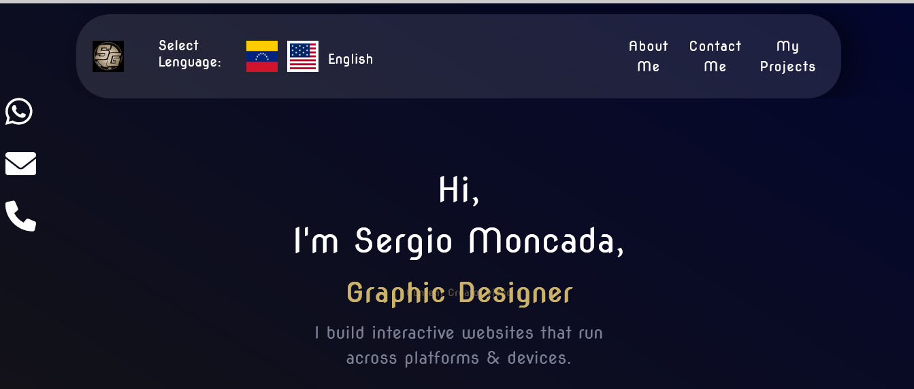
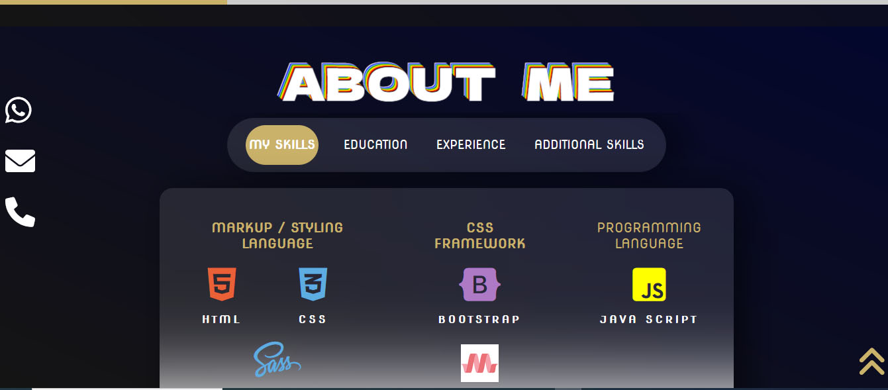
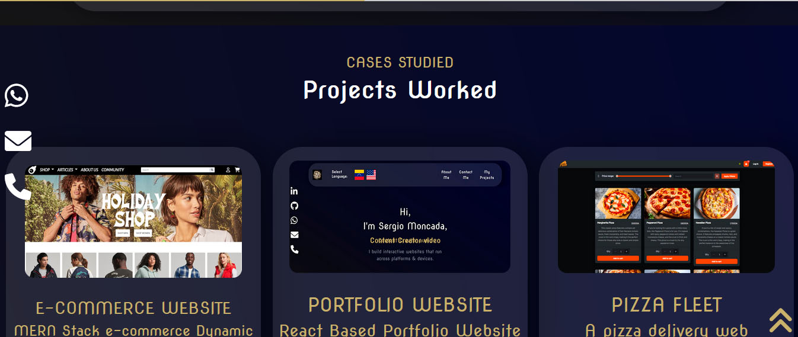
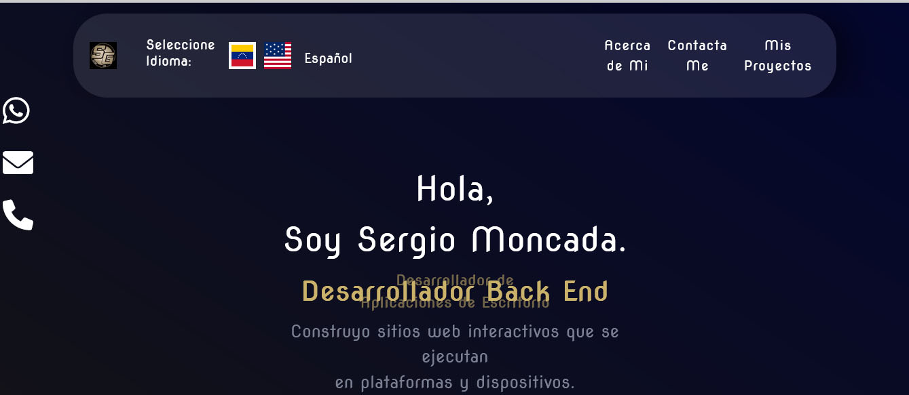

<h1 align ="center" > 🤵🏻 My Personal PortFolio  </h1>
<h1  align ="center"> 
React </h1>
<br>

  * [Configuration and Setup](#configuration-and-setup)
  * [Key Features](#key-features)
  * [Technologies used](#technologies-used)
      - [Frontend](#frontend)
  * [📸 Screenshots](#screenshots)
  * [Author](#author)
  * <br>
  * ## Configuration and Setup

In order to run this project locally, simply fork and clone the repository or download as zip and unzip on your machine.

- Open the project in your prefered code editor.
- Go to terminal -> New terminal (If you are using VS code)

```
$ cd client
$ npm install (to install client-side dependencies)
$ npx expo start -c  (to start the application - cleaning Cache Memory)
NODE VERSION: 19.2.0

```


## ✔️ Tecnologias Utilizadas:


<br>
##  Screenshots:
<br>





<br>

##  Key Features:
  
  
<br/>

##  Technologies used

This project was created using the following technologies.

####  Frontend 

- [React ]
 It is a framework developed by Facebook for creating Aplications under one common language, JavaScript.
- [Bootstrap]

## Author
- Portfolio: 
- Github: 
- Sponsor: 
- Linkedin:(https://www.linkedin.com/in/sergio-moncada-72589883/)
- Email: [sergiogmoncada@yahoo.com](mailto:sergiogmoncada@yahoo.com)


